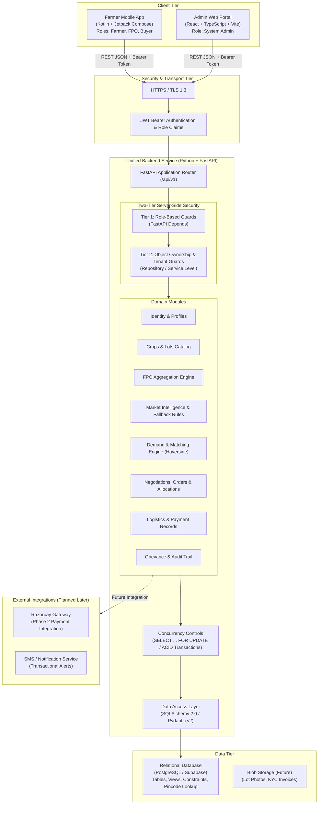
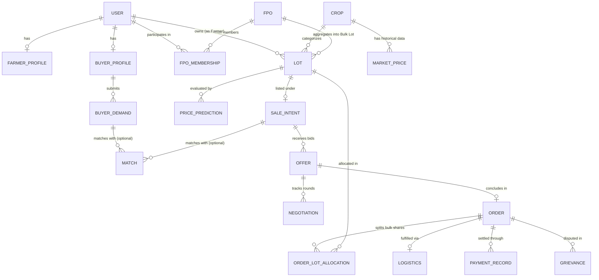
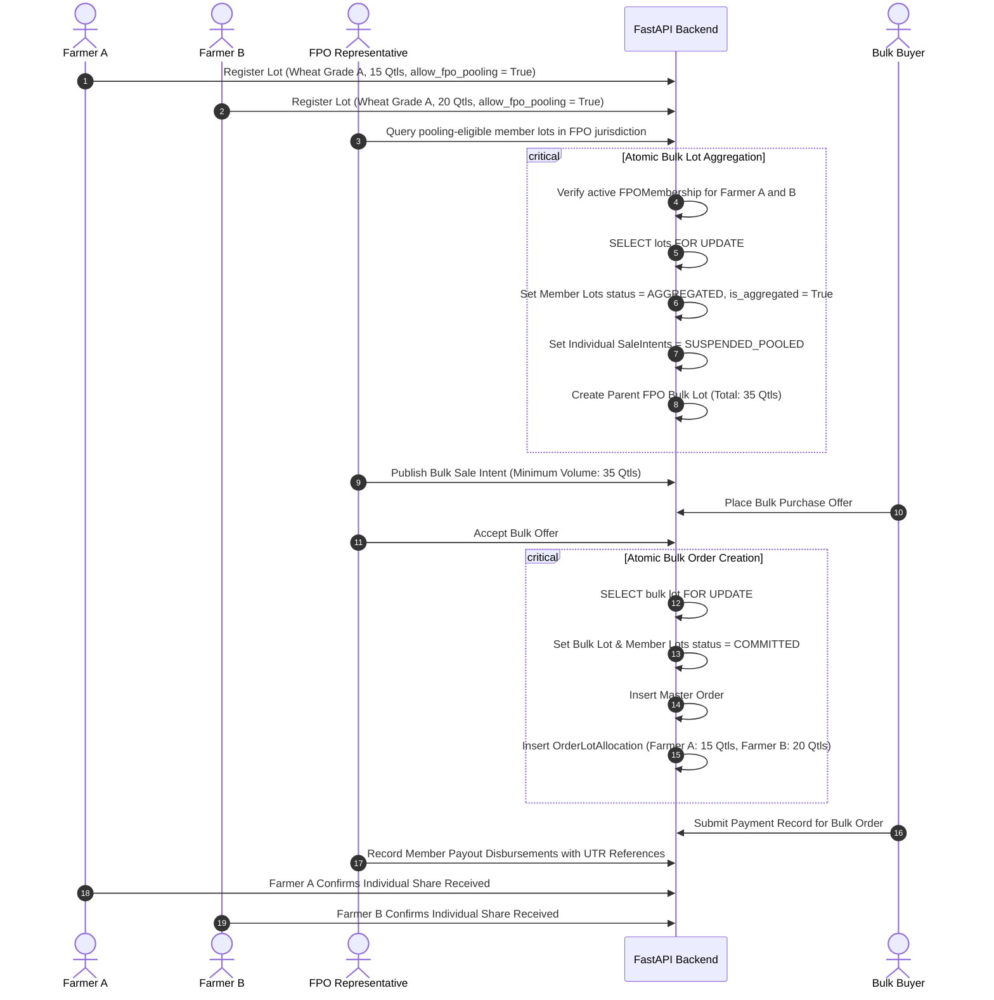
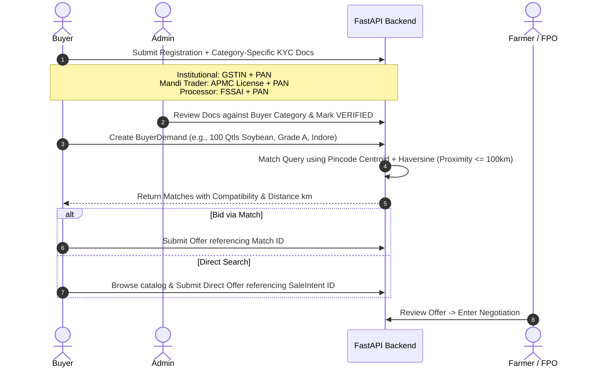

# Kisan BhavSaathi — System Architecture & Technical Specification

**Project:** Kisan BhavSaathi  
**Event:** Smart India Hackathon (SIH) 2026  
**Status:** Step 2 — Architecture Refinement (Post-Review Approved Design Document)  
**Target Root:** `K:\Kisan-BhavSathi`

---

## 1. Purpose and Scope

### 1.1 Purpose
**Kisan BhavSaathi** is an agricultural commerce and market intelligence platform designed to address price asymmetry, fragmented supply chains, and market linkage barriers experienced by Indian farmers. The system enables:
1. **Transparent Price Discovery:** Providing transparent, explainable price intelligence to farmers so they can evaluate fair market value before selling.
2. **Direct Market Linkages:** Connecting individual farmers and Farmer Producer Organizations (FPOs) directly with verified bulk buyers, processors, and retail traders.
3. **Collective Bargaining via FPO Aggregation:** Pooling small, fragmented farmer yields into standardized bulk lots to achieve economies of scale and better price realization.
4. **End-to-End Deal Execution:** Structuring offers, bilateral negotiations, formal order generation, logistics tracking, payment tracking, and dispute management.

### 1.2 Scope Boundaries
To keep the architecture maintainable, realistic, and production-minded for beginners:
- **In Scope:**
  - Multi-role mobile application (Farmer, FPO Representative, Buyer) in Kotlin + Jetpack Compose.
  - Multi-tenant administrative dashboard (Admin Portal) in React + TypeScript.
  - Unified backend API service built with Python + FastAPI.
  - Relational persistence in PostgreSQL (evaluating Supabase as managed PostgreSQL option).
  - Rule-based price intelligence engine with a 3-tier fallback hierarchy and an eventual roadmap towards statistical machine learning.
  - Strict deal lifecycle: Crop $\rightarrow$ Lot $\rightarrow$ Intent $\rightarrow$ Match/Direct Bidding $\rightarrow$ Negotiation $\rightarrow$ Order (with FPO Lot Allocations) $\rightarrow$ Logistics $\rightarrow$ Payment Record $\rightarrow$ Grievance.
- **Out of Scope (Explicit Non-Goals for Initial Steps):**
  - No real-money payment escrow or direct banking clearing (payment tracking will record transaction status and UTR proofs; Razorpay gateway integration is planned for later phases).
  - No imaginary or unverified live government API connections (market data begins with realistic local price seeds and structured APMC benchmark models).
  - No complex microservices or Kubernetes overhead; monolithic modular architecture is prioritized for rapid development, maintainability, and clean debugging.

---

## 2. High-Level System Architecture

The system follows a clean **modular monolith** backend design accessed by two client applications through a unified, secure REST API.



---

## 3. Component Responsibilities

### 3.1 Mobile Client (`farmer-app/`)
- **Technology:** Kotlin with Jetpack Compose (Modern Native Android).
- **Target Audience:** Farmers, FPO Representatives, and Field Buyers.
- **Responsibilities:**
  - Role-adaptive dashboard based on authenticated user claims (one primary role per account for MVP).
  - Simplified, high-contrast, localizable UI optimized for rural mobile viewports.
  - Farmer flows: Register harvest lots, request price estimates with freshness indicators, publish sale intents, review incoming buyer offers, counter-negotiate, confirm dispatch.
  - FPO flows: Inspect member crops, group compatible lots into bulk offerings, negotiate with industrial buyers, review member payout allocations.
  - Buyer flows: Submit crop purchase requirements (RFQs), browse verified lots or bulk offerings, place direct or match-based bids, confirm delivery, log payment references.

### 3.2 Admin Portal (`admin-web/`)
- **Technology:** React + TypeScript with standard component libraries (e.g., Tailwind CSS, Lucide icons).
- **Target Audience:** System Administrators, Market Monitors, Grievance Officers.
- **Responsibilities:**
  - Buyer business credential verification based on category-specific document rules.
  - FPO official onboarding and certificate validation.
  - Oversight of platform-wide market data feeds, price bands, and transaction anomalies.
  - Independent dispute arbitration and grievance resolution panel.
  - System health, audit log inspection, and user activity metrics.

### 3.3 Backend API (`backend/`)
- **Technology:** Python 3.11+ with FastAPI.
- **Responsibilities:**
  - Unified RESTful API providing JSON endpoints under `/api/v1`.
  - Stateless authentication via JWT (JSON Web Tokens) with role claims.
  - Two-tier authorization enforcement (Role-Based + Object Ownership / Tenant Isolation).
  - Strict input validation and serialization using Pydantic v2 schemas.
  - Business workflow and state machine enforcement (Lot, Offer, Order transitions).
  - Concurrency controls and pessimistic row locking (`SELECT ... FOR UPDATE`) preventing double-selling.
  - Market intelligence computation with transparent 3-tier fallback hierarchy.
  - Direct database interaction via SQLAlchemy 2.0 and migration management via Alembic.

### 3.4 Database Tier
- **Technology:** PostgreSQL (with option for managed Supabase instance).
- **Responsibilities:**
  - Relational integrity with foreign key constraints and transactional consistency (`ACID`).
  - Row-level access boundaries and structured audit columns (`created_at`, `updated_at`).
  - Lightweight Indian Pincode coordinate lookup table for Haversine distance computations.
  - Storage of users, crops, pricing histories, lots, orders, allocations, and grievances.

---

## 4. Client-Backend Communication Protocol & Two-Tier Authorization

Both the mobile application and the admin portal communicate with the exact same FastAPI backend instance.

### 4.1 Uniform Base URL & Versioning
All endpoints are namespaced under `/api/v1/` to allow backward compatibility when mobile app client versions lag behind.

### 4.2 Stateless JWT Authentication
On successful login (`/api/v1/auth/login`), the backend returns an access token containing:
```json
{
  "sub": "user-uuid-1234",
  "role": "FARMER",
  "exp": 1791550800
}
```
Both Android app and React web portal attach this token in the HTTP header:  
`Authorization: Bearer <access_token>`.

### 4.3 Mandatory Two-Tier Server-Side Authorization
Client-supplied user IDs, role claims in request bodies, or FPO IDs must **never** be trusted without server-side validation against the authenticated token context.

1. **Tier 1: Role-Based Access Control (RBAC)**
   - Enforced via FastAPI route dependencies:
     ```python
     @router.post("/lots/aggregate")
     def aggregate_lots(
         payload: AggregationRequest, 
         current_user: User = Depends(require_role(["FPO_REPRESENTATIVE"]))
     ):
         ...
     ```
2. **Tier 2: Object-Level Ownership & Tenant Verification**
   - Enforced at the service and repository layer before any data read or mutation:
     - **Farmer Resources:** Every lot, sale intent, or negotiation access checks `lot.farmer_user_id == current_user.id`.
     - **Buyer Resources:** Every buyer demand, offer, or order access checks `demand.buyer_id == current_user.id`.
     - **FPO Operations:** Aggregating lots requires checking that `fpo.created_by_user_id == current_user.id` AND that every aggregated lot belongs to a farmer with an active, confirmed `FPOMembership` in that specific FPO.
     - **Admin Access:** Admins have audit-level access, but all actions are recorded in an audit trail with the admin's user ID.

### 4.4 Standardized Response Envelope & Error Handling
- Success responses deliver predictable payloads under a root `data` object.
- Error responses adhere to RFC 7807 problem details:
  ```json
  {
    "error": {
      "code": "CONCURRENT_MODIFICATION",
      "message": "Lot status has changed or is already committed to another offer.",
      "details": {}
    }
  }
  ```

---

## 5. Roles and Permissions Matrix

For the SIH 2026 MVP, **one primary role per account** (`FARMER`, `FPO_REPRESENTATIVE`, `BUYER`, `ADMIN`) is maintained as a deliberate design simplification. This eliminates complex profile-switching overhead while ensuring clear security boundaries.

| Domain Resource | Farmer | FPO Representative | Buyer | Admin |
| :--- | :--- | :--- | :--- | :--- |
| **User Profile** | Manage own profile | Manage own profile & FPO | Manage own business profile | View/manage all accounts |
| **KYC / Verification** | View own status | Submit FPO docs; view status | Submit category docs; view status | Review & approve/reject KYC |
| **Crops & Lots** | Full CRUD on own lots | View member lots pooled to FPO | Browse public/published lots only | Full read/audit access |
| **FPO Membership** | Request join / approve link | Accept/remove affiliated members | None | Audit memberships |
| **Lot Aggregation** | Consent (opt-in/out pooling) | Aggregate member lots into Bulk Lots | View published Bulk Lots | Audit aggregations |
| **Sale Intents** | Publish/cancel own intents | Publish/cancel FPO bulk intents | Browse active published intents | Audit market intents |
| **Market Intelligence** | View prices & advisories | View prices & advisories | View market prices | Manage benchmark seeds |
| **Buyer Demands (RFQ)** | Browse active buyer demands | Browse active buyer demands | Create/manage own demands | Audit all demands |
| **Matching & Offers** | Receive/negotiate offers on own lots | Receive/negotiate offers on bulk lots | Submit direct or match-based bids | Monitor offer health |
| **Orders & Allocations** | View/confirm own orders & payouts | View/confirm bulk orders & allocations| View/confirm purchase orders | Audit order lifecycle |
| **Logistics** | View dispatch status | Coordinate dispatch for bulk orders | Assign transport / confirm delivery | Monitor logistics issues |
| **Payment Records** | View/confirm payment received | Track member disbursement status | Log payment transfer reference | Audit payment records |
| **Grievances** | Raise/track own dispute | Raise/track dispute for FPO | Raise/track dispute for purchases | Review, arbitrate & close |

---

## 6. Core Business Entities, Domain Model & Lifecycle State Machines



### 6.1 Entity Catalog & Attributes

1. **`User`**: Base identity record.
   - `id` (UUID), `phone_number` (Unique), `hashed_password`, `role` (ENUM: `FARMER`, `FPO_REPRESENTATIVE`, `BUYER`, `ADMIN`), `is_active`, `created_at`.
   - *Note:* Exactly one role per account for MVP.
2. **`FarmerProfile`**: Extended information for farmers.
   - `id`, `user_id` (FK), `full_name`, `state`, `district`, `pincode`, `land_holding_acres`, `kyc_status`.
3. **`FPO`**: Registered Farmer Producer Organization.
   - `id`, `name`, `registration_number`, `district`, `state`, `created_by_user_id` (FK).
4. **`FPOMembership`**: Link between Farmer and FPO.
   - `id`, `fpo_id` (FK), `farmer_user_id` (FK), `status` (`PENDING`, `ACTIVE`, `REJECTED`), `joined_at`.
5. **`BuyerProfile`**: Commercial buyer credentials.
   - `id`, `user_id` (FK), `company_name`, `buyer_category` (ENUM: `INSTITUTIONAL_PROCESSOR`, `WHOLESALER`, `COMMISSION_AGENT`, `RETAILER_EXPORTER`), `gstin` (Nullable), `verification_doc_type` (ENUM: `GSTIN`, `APMC_LICENSE`, `FSSAI_REGISTRATION`, `TRADE_LICENSE`, `PAN`), `verification_doc_number`, `verification_status` (`PENDING`, `VERIFIED`, `REJECTED`).
   - *Note:* GSTIN is optional for categories where not legally required (e.g. small local commission agents or grain aggregators operating under APMC/trade licenses).
6. **`Crop`**: Standardized master catalog of agricultural produce.
   - `id`, `name`, `category` (`CEREALS`, `PULSES`, `OILSEEDS`, `VEGETABLES`, `FRUITS`), `standard_unit` (`QUINTAL`, `KG`).
7. **`Lot`**: Physical batch of harvested crop.
   - `id`, `farmer_user_id` (FK), `crop_id` (FK), `quantity`, `quality_grade` (`GRADE_A`, `GRADE_B`, `GRADE_C`), `moisture_percentage`, `storage_location_pincode`, `is_aggregated` (Boolean), `parent_fpo_lot_id` (FK to Lot, Nullable), `status` (ENUM: `DRAFT`, `AVAILABLE`, `AGGREGATED`, `COMMITTED`, `SOLD`, `CANCELLED`).
8. **`SaleIntent`**: Commercial intent to sell a Lot.
   - `id`, `lot_id` (FK), `expected_price_per_unit`, `minimum_acceptable_price`, `available_from_date`, `available_until_date`, `allow_fpo_pooling` (Boolean), `status` (ENUM: `ACTIVE`, `SUSPENDED_POOLED`, `MATCHED`, `CLOSED`, `CANCELLED`).
9. **`MarketPrice`**: Benchmark prices from regional mandis.
   - `id`, `crop_id` (FK), `mandi_name`, `district`, `state`, `min_price`, `max_price`, `modal_price`, `price_date`.
10. **`PricePrediction`**: Explainable price guidance.
    - `id`, `crop_id` (FK), `lot_id` (FK), `suggested_min_price`, `suggested_modal_price`, `suggested_max_price`, `confidence_score`, `data_source_tier` (`DISTRICT`, `STATE`, `NATIONAL_BASELINE`), `data_freshness_days`, `explanation_summary`, `generated_at`.
11. **`BuyerDemand`**: Purchase request / Request For Quote (RFQ) from a buyer.
    - `id`, `buyer_id` (FK), `crop_id` (FK), `required_quantity`, `acceptable_grades`, `max_budget_price`, `delivery_destination_pincode`, `required_by_date`, `status` (`OPEN`, `FULFILLED`, `CANCELLED`).
12. **`Match`**: Algorithmic compatibility association.
    - `id`, `buyer_demand_id` (FK), `sale_intent_id` (FK), `compatibility_score`, `distance_km` (calculated via Pincode Haversine), `created_at`.
13. **`Offer`**: Formal bid placed on a Sale Intent or Bulk Lot.
    - `id`, `match_id` (FK, Nullable for direct bids), `sale_intent_id` (FK), `buyer_id` (FK), `seller_user_id` (FK), `proposed_price_per_unit`, `proposed_quantity`, `status` (`PENDING`, `COUNTERED`, `ACCEPTED`, `REJECTED`, `EXPIRED`).
14. **`Negotiation`**: Counter-offer audit trail.
    - `id`, `offer_id` (FK), `sender_user_id` (FK), `counter_price_per_unit`, `remarks`, `created_at`.
15. **`Order`**: Binding contract generated upon mutual acceptance of an Offer.
    - `id`, `offer_id` (FK), `buyer_id` (FK), `seller_id` (FK, Farmer or FPO), `agreed_price_per_unit`, `total_quantity`, `total_amount`, `is_fpo_bulk_order` (Boolean), `order_status` (`CONFIRMED`, `DISPATCHED`, `DELIVERED`, `COMPLETED`, `CANCELLED`).
16. **`OrderLotAllocation`**: Member payout and allocation ledger for FPO bulk orders.
    - `id`, `order_id` (FK), `lot_id` (FK), `farmer_user_id` (FK), `allocated_quantity`, `member_share_amount`, `payout_status` (ENUM: `PENDING`, `DISBURSED`, `CONFIRMED_BY_FARMER`), `disbursement_reference` (Nullable), `created_at`.
17. **`Logistics`**: Transportation dispatch record.
    - `id`, `order_id` (FK), `transporter_name`, `vehicle_number`, `driver_phone`, `pickup_timestamp`, `delivery_timestamp`, `tracking_status` (`PENDING_PICKUP`, `IN_TRANSIT`, `DELIVERED`).
18. **`PaymentRecord`**: Financial settlement tracking entry.
    - `id`, `order_id` (FK), `payment_stage` (`ADVANCE`, `FINAL_SETTLEMENT`), `amount`, `payment_method` (`BANK_TRANSFER`, `UPI`, `OFFLINE_CASH`, `FUTURE_RAZORPAY`), `transaction_reference` (UTR number), `status` (`SUBMITTED`, `VERIFIED_BY_SELLER`, `DISPUTED`).
19. **`Grievance`**: Formal dispute ticket.
    - `id`, `order_id` (FK), `filed_by_user_id` (FK), `issue_category` (`QUALITY_DEFECT`, `WEIGHT_SHORTAGE`, `PAYMENT_DELAY`, `TRANSIT_DAMAGE`), `description`, `status` (`OPEN`, `INVESTIGATING`, `RESOLVED`, `CLOSED`), `admin_resolution_notes`.

---

### 6.2 Lot Lifecycle State Machine & Valid Transitions

To eliminate double-selling, every `Lot` strictly adheres to this state machine:

```text
       +-----------------------------------------------------------+
       |                                                           |
       v                                                           |
   [ DRAFT ] ---> [ AVAILABLE ] ---> [ AGGREGATED ]                |
                      |    |               |                       |
                      |    | (Order)       | (Bulk Order)          |
                      |    +---------------+                       |
                      |            |                               |
                      |            v                               |
                      |     [ COMMITTED ] ---> [ SOLD ] (Terminal) |
                      |            |                               |
                      |            | (Dispute / Cancellation)      |
                      |            +-------------------------------+
                      v
                [ CANCELLED ] (Terminal)
```

| From State | To State | Trigger / Condition | Side Effects / Invariants |
| :--- | :--- | :--- | :--- |
| `DRAFT` | `AVAILABLE` | Farmer publishes lot with a `SaleIntent`. | Lot becomes visible for matching / direct browsing. |
| `DRAFT` | `CANCELLED` | Farmer discards draft. | Lot becomes inactive. |
| `AVAILABLE` | `AGGREGATED` | FPO includes lot in Bulk Lot. | **Atomic:** Individual `SaleIntent` set to `SUSPENDED_POOLED`. Lot removed from individual search. |
| `AGGREGATED` | `AVAILABLE` | FPO disbands bulk lot before sale. | **Atomic:** Individual `SaleIntent` restored to `ACTIVE`. |
| `AVAILABLE` | `COMMITTED` | Direct offer accepted by Farmer. | **Pessimistic Lock:** Lot locked via `SELECT FOR UPDATE`. Order created. `SaleIntent` set to `CLOSED`. |
| `AGGREGATED` | `COMMITTED` | Bulk offer accepted by FPO. | **Pessimistic Lock:** All member lots locked via `SELECT FOR UPDATE`. Master order & `OrderLotAllocation` entries created. |
| `AVAILABLE` | `CANCELLED` | Farmer cancels listing before any offer is accepted. | Associated `SaleIntent` marked `CANCELLED`. |
| `COMMITTED` | `SOLD` | Delivery verified and seller confirms payment. | Terminal state. Deal completed. |
| `COMMITTED` | `AVAILABLE` | Order cancelled before dispatch due to mutually agreed cancellation. | Lot restored to `AVAILABLE`; `SaleIntent` reactivated. |

---

### 6.3 Concurrency Control & Double-Selling Prevention
1. **Pessimistic Row Locking on Mutating Actions:**
   When an offer is accepted or an FPO aggregates lots, the backend MUST lock the target row(s) using `SELECT ... FOR UPDATE` within a PostgreSQL transaction:
   ```sql
   -- Conceptual backend concurrency pattern
   BEGIN;
   SELECT id, status FROM lots WHERE id = :lot_id FOR UPDATE;
   -- Application checks: lot must be AVAILABLE (or AGGREGATED for bulk order)
   -- If not AVAILABLE -> Rollback and raise CONCURRENT_MODIFICATION error
   UPDATE lots SET status = 'COMMITTED' WHERE id = :lot_id;
   UPDATE sale_intents SET status = 'CLOSED' WHERE lot_id = :lot_id;
   INSERT INTO orders (...) VALUES (...);
   COMMIT;
   ```
2. **Atomic Aggregation Suspension:**
   An FPO cannot aggregate a lot unless `allow_fpo_pooling == True` AND `status == 'AVAILABLE'`. In the aggregation transaction, the individual `SaleIntent` is immediately updated to `SUSPENDED_POOLED` so individual buyers cannot bid on it.
3. **Offer Acceptance Race Conditions:**
   If Buyer A and Buyer B submit offers on the same individual lot, the first accepted offer commits the lot and creates the order. When the second transaction attempts to lock the lot, it detects `status != 'AVAILABLE'` and safely fails with HTTP 409 Conflict.

---

## 7. Main Workflow Diagrams

### 7.1 End-to-End Farmer Transaction Flow

```mermaid
sequenceDiagram
    autonumber
    actor Farmer
    participant Backend as FastAPI Backend
    participant Engine as Market Intelligence
    actor Buyer
    actor Admin

    Farmer->>Backend: 1. Create Lot (Crop, Quantity, Grade, Location)
    Farmer->>Backend: 2. Request Price Advisory
    Backend->>Engine: Run 3-tier fallback lookup & grade adjustments
    Engine-->>Backend: Price Range + Freshness Indicator + Explanations
    Backend-->>Farmer: Display advisory (e.g., ₹2,200 - ₹2,450/qtl, Fresh: 2 days)
    
    Farmer->>Backend: 3. Publish SaleIntent (Expected & Min Price, Allow Pooling)
    Backend->>Backend: Status = AVAILABLE; Match against active BuyerDemands
    
    alt Algorithmic Match
        Backend-->>Buyer: Matched Listing Alert
        Buyer->>Backend: 4a. Submit Offer via Match ID
    else Direct Marketplace Browsing
        Buyer->>Backend: 4b. Submit Direct Offer on SaleIntent ID
    end
    
    Backend-->>Farmer: Real-time Offer Notification
    Farmer->>Backend: 5. Counter-Negotiate or Accept Offer
    Buyer->>Backend: 6. Concur with terms
    
    critical Atomic Order Creation
        Backend->>Backend: SELECT lot FOR UPDATE
        Backend->>Backend: Verify lot is AVAILABLE
        Backend->>Backend: Set lot = COMMITTED, SaleIntent = CLOSED
        Backend->>Backend: Insert Order
    end
    
    Buyer->>Backend: 7. Dispatch Logistics (Vehicle & Tracking details)
    Farmer->>Backend: 8. Confirm Pickup / Dispatch
    Buyer->>Backend: 9. Acknowledge Delivery & Inspect Grade
    
    Buyer->>Backend: 10. Submit Payment Record (UTR / Transaction Ref)
    Farmer->>Backend: 11. Confirm Payment Received (Lot = SOLD, Order = COMPLETED)
    
    opt Quality Dispute or Payment Default
        Farmer->>Backend: 12. Raise Grievance Ticket
        Backend->>Admin: Escalate to Admin Portal
        Admin->>Backend: Arbitrate & Record Resolution
    end
```

### 7.2 FPO Member Lot Aggregation Flow



### 7.3 Buyer Demand & Flexible Verification Flow



---

## 8. Data Ownership, Access Control & Server-Side Security

### 8.1 Farmer Data Ownership and Privacy
1. **Tenant Isolation:** A farmer's personal contact details, landholding size, and draft lots are strictly private.
2. **Masked Public Discovery:** Browsing buyers see generalized data: Crop variety, quality grade, quantity, and district. Exact contact numbers and farm pickup locations are disclosed only after an Order is generated.
3. **Revocation Rights:** A farmer maintains the right to cancel or withdraw a Sale Intent at any point prior to an accepted offer locking the lot.

### 8.2 FPO Authority & Member Consent Auditing
1. **Active Membership Precondition:** An FPO Representative can only inspect and aggregate lots belonging to farmers who have an active, validated record in `FPOMembership` for that specific FPO.
2. **Explicit Lot-Level Consent:** Aggregation strictly requires `allow_fpo_pooling == True` on the target lot. Membership alone does not grant blanket liquidation rights.
3. **Member Allocation Audit Trail:** The `OrderLotAllocation` table creates an immutable, transparent record of how much quantity each farmer contributed and their calculated rupee payout. Individual members can audit their allocation records directly from their mobile app.

---

## 9. Market Intelligence & AI Boundaries

To ensure algorithmic integrity and prevent misleading agricultural advice, a clear boundary is established between deterministic calculations and statistical estimations.

```text
+--------------------------------------------------------------------------+
|                  MARKET INTELLIGENCE DESIGN PRINCIPLE                    |
|                                                                          |
|  1. Price predictions are ESTIMATES WITH EXPLANATIONS, not guarantees.   |
|  2. The system NEVER promises that a buyer will pay the estimated price. |
|  3. Real prices are NEVER fabricated or hallucinated.                    |
|  4. Every estimate displays: Price Range, Freshness, and Source Tier.    |
+--------------------------------------------------------------------------+
```

### 9.1 Three-Tier Fallback Hierarchy
When calculating market price benchmarks, the engine executes a strict fallback hierarchy:
1. **Tier 1: Recent District Mandi Benchmark**
   - 7-day weighted moving average of reported modal prices from mandis within the lot's district.
2. **Tier 2: State-Level Benchmark**
   - If no district data exists within the last 7 days, fallback to a 14-day state-level average for that crop variety.
3. **Tier 3: National Seasonal Baseline**
   - If state-level data is unavailable or stale ($> 14$ days), fallback to the official seasonal Minimum Support Price (MSP) or national historical baseline.

### 9.2 Quality Grade & Logistics Adjustments
- **Grade A:** $+5\%$ to $+10\%$ above benchmark modal price.
- **Grade B:** Baseline modal price ($0\%$).
- **Grade C:** $-8\%$ to $-15\%$ below benchmark modal price (due to high moisture or foreign matter).
- **Proximity Deduction:** Deducts estimated standard freight per quintal/km from lot pincode to destination or consumption cluster.

### 9.3 Data Freshness & Stale-Data Warning
- Every advisory payload includes:
  - `data_source_tier` (`DISTRICT`, `STATE`, `NATIONAL_BASELINE`)
  - `data_freshness_days` (integer)
- **Stale Data Warning:** If `data_freshness_days > 7`, the response includes a clear warning flag, and the UI displays:  
  *⚠️ "Warning: Limited recent mandi arrivals in your district. Price estimate is derived from broader regional benchmarks and should be treated as an indicative guideline."*

### 9.4 Phase 2 Machine Learning Roadmap
- **Prerequisites for ML Activation:** At least 60 days of genuine historical price time-series and at least 500 fulfilled orders across targeted crop varieties.
- Supervised regression models (LightGBM / XGBoost) will only be introduced once genuine data exists, falling back to Tier 1-3 rules whenever model uncertainty exceeds $30\%$.

---

## 10. API and Database Design Principles

### 10.1 API Design Principles
- **JSON RESTful Standards:** Standard HTTP verbs (`GET`, `POST`, `PATCH`, `DELETE`).
- **Pagination by Default:** All list endpoints (`/api/v1/lots`, `/api/v1/demands`) require `page` and `limit` query parameters (capped at 100 items).
- **Idempotency on Mutating Actions:** Critical transactions (offer acceptance, order creation) accept client-generated `Idempotency-Key` headers to avoid duplicate processing on mobile network retries.
- **Structured Validation Errors:** FastAPI automatically leverages Pydantic schemas to reject malformed requests with exact field error pointers before code execution reaches domain services.

### 10.2 Database Design Principles
- **Surrogate UUID Keys:** Primary keys use UUIDv4 to avoid enumeration attacks and facilitate decentralized offline generation on mobile if needed.
- **Pincode Proximity via Haversine (No PostGIS for MVP):**
  - A lightweight reference table `pincode_coordinates` (`pincode`, `latitude`, `longitude`, `district`, `state`) maps user pincodes to centroid coordinates.
  - Distance between lots and buyer demands is computed via the standard Haversine formula directly in Python or pure SQL math, avoiding PostGIS setup complexity for beginners.
- **Normalized Schema & Audit Columns:**
  - 3rd Normal Form (3NF) for transactional data.
  - Every table includes `created_at` and `updated_at` (UTC timestamps).
- **Strict Foreign Key Constraints:** Cascading rules prevent orphaned children.

---

## 11. Phased Implementation Roadmap

To maintain engineering discipline and adhere to our strict one-step-at-a-time methodology:

| Step | Focus Area | Key Deliverables | Status |
| :---: | :--- | :--- | :---: |
| **Step 1** | Project Scaffolding | Folder structure (`backend/`, `farmer-app/`, `admin-web/`, `docs/`) and root `README.md`. | **COMPLETED** |
| **Step 2** | Architecture Planning & Refinement | `docs/architecture.md` (fully refined and verified design document). | **CURRENT** |
| **Step 3** | Backend Skeleton Foundation | FastAPI app skeleton, directory layout, environment configuration (`.env` handling), base logging, CORS setup, and a working `/health` endpoint. *No database models or auth in this step.* | Upcoming |
| **Step 4** | Database Models & Migrations | SQLAlchemy database models for Core Entities, Alembic configuration, initial schema migration. | Upcoming |
| **Step 5** | Authentication & Two-Tier RBAC | JWT auth, password hashing, role dependencies, object-ownership verification helpers. | Upcoming |
| **Step 6** | Crop & Lot Management | CRUD endpoints for Crops, Harvest Lots, and Sale Intents with state machine enforcement. | Upcoming |
| **Step 7** | Market Intelligence Engine | Mandi price ingestion models, 3-tier fallback hierarchy, and explainable price calculator. | Upcoming |
| **Step 8** | Buyer Demand & Matching | RFQ endpoints for buyers, Pincode Haversine proximity calculation, and matching engine. | Upcoming |
| **Step 9** | Offers, Negotiation & Orders | Direct and match-based bidding, counter-offer rounds, concurrency-safe order creation (`SELECT FOR UPDATE`). | Upcoming |
| **Step 10** | FPO Lot Aggregation | Member verification, lot pooling, bulk lot management, and `OrderLotAllocation` distribution. | Upcoming |
| **Step 11** | Fulfillment & Grievances | Logistics dispatch updates, payment record tracking, grievance filing & resolution. | Upcoming |
| **Step 12** | Admin Web Portal | React + TypeScript scaffolding, admin auth, user verification & grievance dashboard. | Upcoming |
| **Step 13** | Farmer Mobile Application | Kotlin + Jetpack Compose app foundation, offline caching, farmer & FPO user interfaces. | Upcoming |
| **Step 14** | Integration & Demo Polish | End-to-end integration testing, sample seed data for SIH presentation, demo hardening. | Upcoming |

---

## 12. Key Technical Risks, Security Considerations & Open Decisions

### 12.1 Security & Integrity Considerations
- **Credential Storage:** Passwords hashed with bcrypt (minimum work factor 12).
- **Token Security:** Short-lived JWT access tokens (e.g., 30 minutes) paired with secure refresh tokens stored safely in mobile secure storage / HTTP-only web cookies.
- **SQL Injection Prevention:** Enforced parameterized queries via SQLAlchemy ORM; direct raw SQL string interpolation is prohibited.
- **Rate Limiting:** Critical endpoints (`/auth/login`, `/auth/register`, `/offers`) will be rate-limited to avoid brute-force and spamming attacks.

### 12.2 Technical Risks & Mitigation
- **Rural Connectivity Latency:** Mobile networks in agricultural areas may drop intermittently.
  - *Mitigation:* The mobile client will use a local SQLite (Room) cache for read views, queue mutations locally, and sync upon network recovery.
- **Market Data Sparsity:** Real mandi prices can vary or report irregularly across states.
  - *Mitigation:* The 3-tier fallback hierarchy ensures transparent, non-hallucinatory price guidance with prominent data freshness warnings.
- **Unverified Buyer Fraud:** Risk of bogus buyers bidding without intent to purchase.
  - *Mitigation:* Mandatory admin verification of category-specific trade documents before a buyer account is permitted to issue binding purchase offers.

### 12.3 Open Decisions (Explicitly Marked for Later Steps)

> [!NOTE]
> The following items are explicitly marked as **OPEN DECISIONS** and will be formally resolved in their corresponding implementation steps:

1. **OPEN DECISION — Database Hosting: Self-Hosted PostgreSQL vs. Managed Supabase**
   - *Consideration:* Supabase provides managed PostgreSQL, real-time subscriptions, and built-in auth, whereas self-hosted PostgreSQL via Docker offers complete portability with zero cloud vendor lock-in. To be evaluated during Step 4.
2. **OPEN DECISION — Mandi Price Seeding Source**
   - *Consideration:* Whether to seed initial market price data via official public Agmarknet daily CSV dumps or create a deterministic mock price generator with seasonal variance. To be resolved during Step 7.
3. **OPEN DECISION — Mobile Offline Synchronization Depth**
   - *Consideration:* Full two-way offline synchronization (Room + WorkManager) vs. an online-first architecture with resilient offline caching for critical screens. To be resolved during Step 13.
4. **OPEN DECISION — Future Payment Provider Integration Mode**
   - *Consideration:* Standard Razorpay Payment Links vs. Razorpay Route (marketplace split payments between buyer, FPO, and individual farmers). To be addressed when payment features are scheduled.
