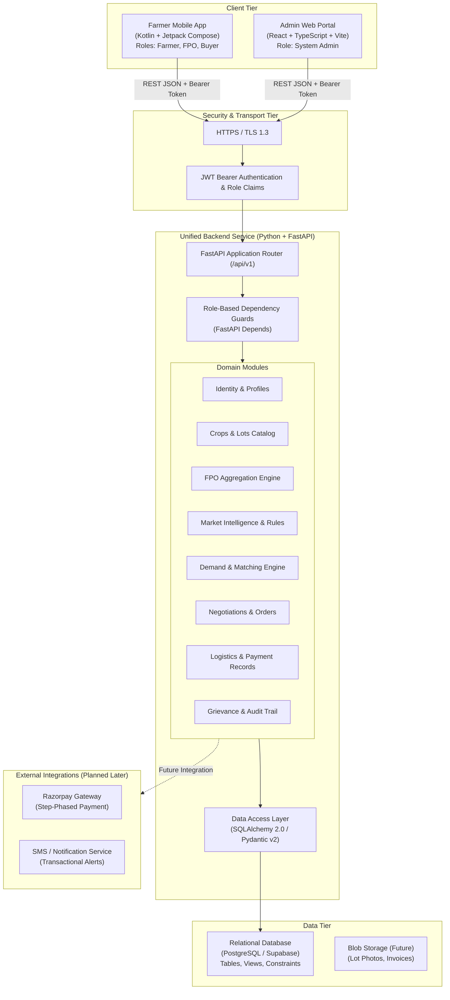
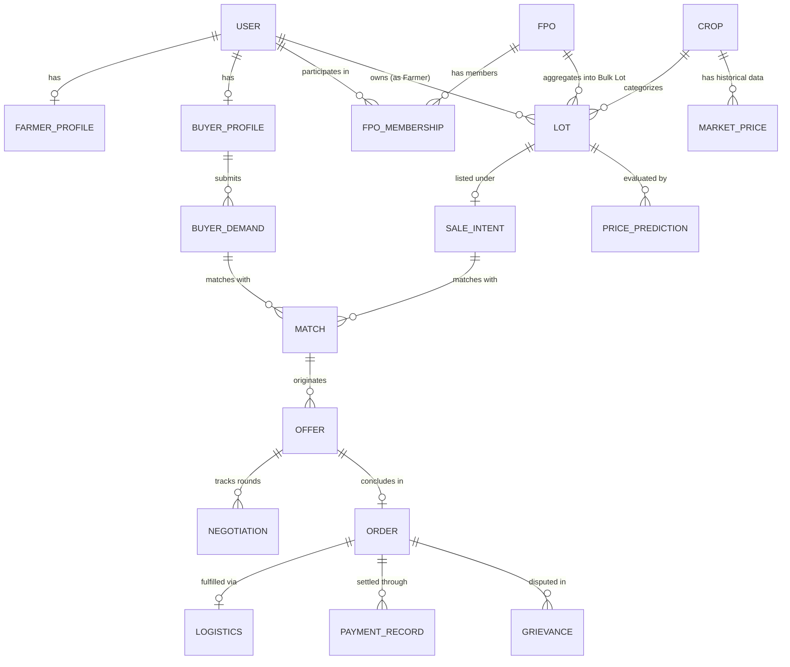
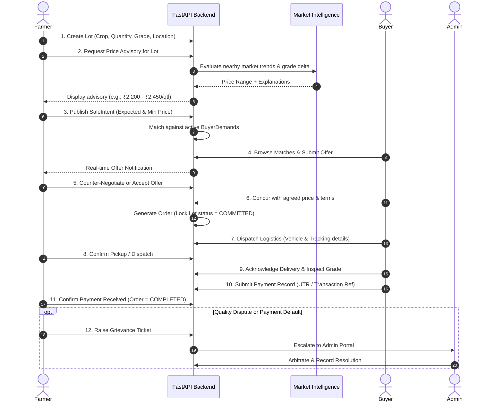
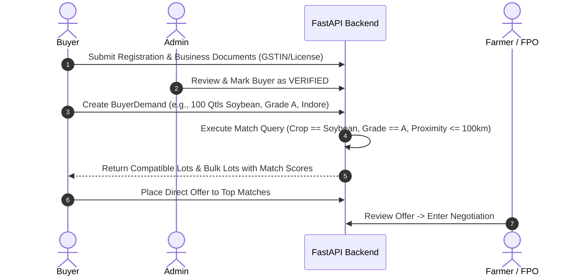

# Kisan BhavSaathi — System Architecture & Technical Specification

**Project:** Kisan BhavSaathi  
**Event:** Smart India Hackathon (SIH) 2026  
**Status:** Step 2 — Architecture Planning (Approved Design Document)  
**Target Root:** `K:\Kisan-BhavSathi`

---

## 1. Purpose and Scope

### 1.1 Purpose
**Kisan BhavSaathi** is an agricultural commerce and market intelligence platform designed to address critical price asymmetry and fragmented market linkages experienced by Indian farmers. The system enables:
1. **Transparent Price Discovery:** Providing transparent, explainable price intelligence to farmers so they can evaluate fair market value before selling.
2. **Direct Market Linkages:** Connecting individual farmers and Farmer Producer Organizations (FPOs) directly with verified bulk buyers, processors, and retail traders.
3. **Collective Bargaining via FPO Aggregation:** Pooling small, fragmented farmer yields into standardized bulk lots to achieve economies of scale and better price realization.
4. **End-to-End Deal Execution:** Structuring offers, bilateral negotiations, formal order generation, logistics tracking, and dispute management.

### 1.2 Scope Boundaries
To keep the architecture maintainable, realistic, and production-minded for beginners:
- **In Scope:**
  - Multi-role mobile application (Farmer, FPO Representative, Buyer) in Kotlin + Jetpack Compose.
  - Multi-tenant administrative dashboard (Admin Portal) in React + TypeScript.
  - Unified backend API service built with Python + FastAPI.
  - Relational persistence in PostgreSQL (evaluating Supabase as managed PostgreSQL option).
  - Rule-based price intelligence engine with a roadmap towards statistical machine learning.
  - Structured deal lifecycle: Crop $\rightarrow$ Lot $\rightarrow$ Intent $\rightarrow$ Match $\rightarrow$ Negotiation $\rightarrow$ Order $\rightarrow$ Logistics $\rightarrow$ Payment Record $\rightarrow$ Grievance.
- **Out of Scope (Explicit Non-Goals for Initial Steps):**
  - No real-money payment escrow or direct banking clearing (payment tracking will record status; Razorpay integration is planned for later).
  - No imaginary or unverified live government API connections (market data begins with realistic local price seeds and structured APMC models).
  - No complex microservices or Kubernetes overhead; monolithic modular architecture is prioritized for rapid development, maintainability, and clean debugging.

---

## 2. High-Level System Architecture

The system follows a clean **modular monolith** backend design accessed by two client applications through a unified, secure REST API.



---

## 3. Component Responsibilities

### 3.1 Mobile Client (`farmer-app/`)
- **Technology:** Kotlin with Jetpack Compose (Modern Native Android).
- **Target Audience:** Farmers, FPO Representatives, and Field Buyers.
- **Responsibilities:**
  - Role-adaptive dashboard based on authenticated user claims.
  - Simplified, high-contrast, localizable UI optimized for rural mobile viewports.
  - Farmer flows: Register harvest lots, request price estimates, publish sale intents, review incoming buyer offers, counter-negotiate, confirm dispatch.
  - FPO flows: Inspect member crops, group compatible lots into bulk offerings, negotiate with industrial buyers.
  - Buyer flows: Submit crop purchase requirements (RFQs), browse available verified lots, place bids.

### 3.2 Admin Portal (`admin-web/`)
- **Technology:** React + TypeScript with standard component libraries (e.g., Tailwind CSS, Lucide icons).
- **Target Audience:** System Administrators, Market Monitors, Grievance Officers.
- **Responsibilities:**
  - Buyer business credential verification (GSTIN, trade license approval).
  - FPO official onboarding and certificate validation.
  - Oversight of platform-wide market data feeds, price bands, and transaction anomalies.
  - Independent dispute arbitration and grievance resolution panel.
  - System health, audit log inspection, and user activity metrics.

### 3.3 Backend API (`backend/`)
- **Technology:** Python 3.11+ with FastAPI.
- **Responsibilities:**
  - Unified RESTful API providing JSON endpoints under `/api/v1`.
  - Stateless authentication via JWT (JSON Web Tokens) with role claims.
  - Strict input validation and serialization using Pydantic v2 models.
  - Business workflow enforcement (state machine transitions for Lots, Offers, Orders).
  - Market intelligence computation (baseline moving averages, grade adjustments).
  - Direct database interaction via SQLAlchemy 2.0 and migration management via Alembic.

### 3.4 Database Tier
- **Technology:** PostgreSQL (with option for managed Supabase instance).
- **Responsibilities:**
  - Relational integrity with foreign key constraints and transactional consistency (`ACID`).
  - Row-level access boundaries and structured audit columns (`created_at`, `updated_at`).
  - Storage of users, geographic locations, crop varieties, pricing histories, and orders.

---

## 4. Client-Backend Communication Protocol

Both the mobile application and the admin portal communicate with the exact same FastAPI backend instance.

1. **Uniform Base URL & Versioning:** All endpoints are namespaced under `/api/v1/` to allow seamless backward compatibility when mobile app versions lag behind.
2. **Stateless JWT Authentication:**
   - On successful login (`/api/v1/auth/login`), the backend returns an access token containing:
     ```json
     {
       "sub": "user-uuid-1234",
       "role": "FARMER",
       "fpo_id": null,
       "exp": 1791550800
     }
     ```
   - Both Android app and React web portal attach this token in the HTTP header:
     `Authorization: Bearer <access_token>`.
3. **Role Guards in FastAPI:**
   - Routes declare access requirements using FastAPI's dependency injection system:
     ```python
     # Example architecture pattern
     @router.post("/lots/aggregate")
     def aggregate_lots(
         payload: AggregationRequest, 
         current_user: User = Depends(require_role(["FPO_REPRESENTATIVE"]))
     ):
         ...
     ```
4. **Standardized Response Envelope & Error Handling:**
   - Success responses deliver predictable payloads.
   - Error responses adhere to RFC 7807 problem details:
     ```json
     {
       "error": {
         "code": "INVALID_LOT_STATUS",
         "message": "Cannot aggregate a lot that is already COMMITTED or SOLD.",
         "details": {}
       }
     }
     ```

---

## 5. Roles and Permissions Matrix

The platform establishes four distinct actor roles with strictly demarcated privilege boundaries.

| Domain Resource | Farmer | FPO Representative | Buyer | Admin |
| :--- | :--- | :--- | :--- | :--- |
| **User Profile** | Manage own profile | Manage own profile & view FPO details | Manage own business profile | View/manage all accounts |
| **KYC / Verification** | View own status | Submit FPO docs; view status | Submit business docs; view status | Review and approve/reject KYC |
| **Crops & Lots** | Create/Edit/View own lots | View member lots assigned to FPO | Browse public/published lots only | Full read/audit access |
| **FPO Membership** | Request join / approve link | Accept/remove affiliated members | None | Audit memberships |
| **Lot Aggregation** | Opt-in/out own lots | Aggregate member lots into Bulk Lots | View published Bulk Lots | Audit aggregations |
| **Sale Intents** | Publish/cancel own intents | Publish/cancel FPO bulk intents | Browse published intents | Audit market intents |
| **Market Intelligence** | View prices & advisories | View prices & advisories | View market prices | Manage price benchmarks |
| **Buyer Demands (RFQ)** | Browse active buyer demands | Browse active buyer demands | Create/manage own demands | Audit all demands |
| **Matching & Offers** | Receive/negotiate offers on own lots | Receive/negotiate offers on bulk lots | Submit bids; negotiate matches | Monitor offer health |
| **Orders** | View/confirm own orders | View/confirm FPO bulk orders | View/confirm own purchase orders | Audit order lifecycle |
| **Logistics** | View dispatch status | Coordinate dispatch for bulk orders | Assign transport / confirm delivery | Monitor logistics issues |
| **Payment Records** | View payment status | View & track member payouts | Log payment transfer reference | Audit payment records |
| **Grievances** | Raise/track own dispute | Raise/track dispute for FPO | Raise/track dispute for purchases | Review, arbitrate & close |

---

## 6. Core Business Entities and Domain Model



### 6.1 Entity Catalog & Attributes

1. **`User`**: Base authentication record.
   - `id` (UUID), `phone_number` (Unique), `hashed_password`, `role` (ENUM: `FARMER`, `FPO_REPRESENTATIVE`, `BUYER`, `ADMIN`), `is_active`, `created_at`.
2. **`FarmerProfile`**: Extended information for farmers.
   - `id`, `user_id`, `full_name`, `state`, `district`, `pincode`, `land_holding_acres`, `kyc_status`.
3. **`FPO`**: Registered Farmer Producer Organization.
   - `id`, `name`, `registration_number`, `district`, `state`, `created_by_user_id`.
4. **`FPOMembership`**: Association between a Farmer and an FPO.
   - `id`, `fpo_id`, `farmer_user_id`, `status` (`PENDING`, `ACTIVE`, `REJECTED`), `joined_at`.
5. **`BuyerProfile`**: Commercial buyer credentials.
   - `id`, `user_id`, `company_name`, `gstin`, `trade_license_number`, `buyer_type` (`PROCESSOR`, `WHOLESALER`, `EXPORTER`), `verification_status`.
6. **`Crop`**: Standardized master catalog of agricultural produce.
   - `id`, `name`, `category` (`CEREALS`, `PULSES`, `OILSEEDS`, `VEGETABLES`, `FRUITS`), `standard_unit` (`QUINTAL`, `KG`).
7. **`Lot`**: A physical batch of harvested crop.
   - `id`, `farmer_user_id`, `crop_id`, `quantity`, `quality_grade` (`GRADE_A`, `GRADE_B`, `GRADE_C`), `moisture_percentage`, `storage_location_pincode`, `is_aggregated`, `parent_fpo_lot_id`, `status` (`DRAFT`, `AVAILABLE`, `COMMITTED`, `SOLD`).
8. **`SaleIntent`**: Commercial intent to sell a Lot.
   - `id`, `lot_id`, `expected_price_per_unit`, `minimum_acceptable_price`, `available_from_date`, `available_until_date`, `allow_fpo_pooling` (Boolean), `status` (`ACTIVE`, `MATCHED`, `CLOSED`).
9. **`MarketPrice`**: Daily benchmark prices from regional mandis.
   - `id`, `crop_id`, `mandi_name`, `district`, `state`, `min_price`, `max_price`, `modal_price`, `price_date`.
10. **`PricePrediction`**: Explainable price guidance.
    - `id`, `crop_id`, `lot_id`, `suggested_min_price`, `suggested_modal_price`, `suggested_max_price`, `confidence_score`, `explanation_summary`, `generated_at`.
11. **`BuyerDemand`**: Purchase request / Request For Quote (RFQ) from a buyer.
    - `id`, `buyer_id`, `crop_id`, `required_quantity`, `acceptable_grades`, `max_budget_price`, `delivery_destination_pincode`, `required_by_date`, `status` (`OPEN`, `FULFILLED`, `CANCELLED`).
12. **`Match`**: Algorithmic compatibility match.
    - `id`, `buyer_demand_id`, `sale_intent_id`, `compatibility_score`, `distance_km`, `created_at`.
13. **`Offer`**: Formal bid placed on a Sale Intent or Bulk Lot.
    - `id`, `match_id`, `buyer_id`, `seller_user_id`, `proposed_price_per_unit`, `proposed_quantity`, `status` (`PENDING`, `COUNTERED`, `ACCEPTED`, `REJECTED`, `EXPIRED`).
14. **`Negotiation`**: Counter-offer audit trail.
    - `id`, `offer_id`, `sender_user_id`, `counter_price_per_unit`, `remarks`, `created_at`.
15. **`Order`**: Binding contract created upon mutual acceptance of an Offer.
    - `id`, `offer_id`, `buyer_id`, `seller_id`, `agreed_price_per_unit`, `total_quantity`, `total_amount`, `order_status` (`CONFIRMED`, `DISPATCHED`, `DELIVERED`, `COMPLETED`, `CANCELLED`).
16. **`Logistics`**: Transportation dispatch record.
    - `id`, `order_id`, `transporter_name`, `vehicle_number`, `driver_phone`, `pickup_timestamp`, `delivery_timestamp`, `tracking_status` (`PENDING_PICKUP`, `IN_TRANSIT`, `DELIVERED`).
17. **`PaymentRecord`**: Financial settlement tracking entry.
    - `id`, `order_id`, `payment_stage` (`ADVANCE`, `FINAL_SETTLEMENT`), `amount`, `payment_method` (`BANK_TRANSFER`, `UPI`, `FUTURE_RAZORPAY`), `transaction_reference`, `status` (`SUBMITTED`, `VERIFIED_BY_SELLER`, `DISPUTED`).
18. **`Grievance`**: Formal dispute ticket.
    - `id`, `order_id`, `filed_by_user_id`, `issue_category` (`QUALITY_DEFECT`, `WEIGHT_SHORTAGE`, `PAYMENT_DELAY`, `TRANSIT_DAMAGE`), `description`, `status` (`OPEN`, `INVESTIGATING`, `RESOLVED`, `CLOSED`), `admin_resolution_notes`.

---

## 7. Main Workflow Diagrams

### 7.1 End-to-End Farmer Transaction Flow
This workflow outlines the lifecycle from crop harvest registration to final payment verification and dispute handling.



### 7.2 FPO Member Lot Aggregation Flow
This workflow demonstrates how individual smallholder lots are assembled into attractive commercial volumes.

```mermaid
sequenceDiagram
    autonumber
    actor Farmer1 as Farmer A
    actor Farmer2 as Farmer B
    actor FPO as FPO Representative
    participant Backend as FastAPI Backend
    actor Buyer as Bulk Buyer

    Farmer1->>Backend: Register Lot (Wheat Grade A, 15 Quintals, Allow Pooling = Yes)
    Farmer2->>Backend: Register Lot (Wheat Grade A, 20 Quintals, Allow Pooling = Yes)
    
    FPO->>Backend: View Pooling-Eligible Member Lots in District
    FPO->>Backend: Select Lots & Trigger "Create Bulk Lot" (Total: 35 Quintals)
    Backend->>Backend: Mark Member Lots as AGGREGATED; Create Parent FPO Bulk Lot
    
    FPO->>Backend: Publish FPO Bulk Sale Intent (Minimum Volume: 35 Quintals)
    Buyer->>Backend: Place Bulk Purchase Offer
    FPO->>Backend: Accept Bulk Offer -> Generate Master Order
    Backend->>Backend: Allocate Member Order Shares (Farmer A: 42.8%, Farmer B: 57.2%)
```

### 7.3 Buyer Demand & RFQ Matching Flow
This workflow illustrates institutional buyer demand posting and discovery.



---

## 8. Data Ownership and Access Control

### 8.1 Farmer Data Ownership and Privacy
1. **Tenant Isolation:** A farmer's personal contact details, precise GPS plot points, and draft yields are private.
2. **Masked Public Discovery:** Buyers browsing open market listings see generalized data: Crop variety, quality grade, quantity range, and district/sub-district. Exact contact details and village addresses are only revealed after an offer is formally accepted and an Order is generated.
3. **Revocation of Sale Intents:** A farmer maintains the right to cancel or withdraw a Sale Intent at any point prior to accepting a binding offer.

### 8.2 FPO Authority Boundary
1. **Explicit Membership Verification:** An FPO Representative can only view and aggregate produce from farmers who have an active, validated record in `FPOMembership`.
2. **Explicit Aggregation Consent:** Even if a farmer belongs to an FPO, their crop lot cannot be aggregated unless the farmer set `allow_fpo_pooling = True` on that specific lot.
3. **No Unilateral Liquidation:** The FPO cannot seize or sell member produce below the farmer's stated `minimum_acceptable_price` without member notification.

---

## 9. Market Intelligence & AI Boundaries

To ensure algorithmic integrity and prevent misleading agricultural advice, a clear boundary is established between deterministic calculations and statistical estimations.

```text
+--------------------------------------------------------------------------+
|                  MARKET INTELLIGENCE DESIGN PRINCIPLE                    |
|                                                                          |
|  1. Price predictions are ESTIMATES WITH EXPLANATIONS, not guarantees.   |
|  2. The system NEVER promises that a buyer will pay the estimated price. |
|  3. Every estimate displays: Min Price, Modal Price, Max Price, and      |
|     Key Contributing Factors (e.g. Grade, Proximity, 7-Day Trend).       |
+--------------------------------------------------------------------------+
```

### 9.1 Phase 1: Transparent Deterministic Rules (No Unreliable Hallucinations)
During early stages before vast proprietary trade datasets exist, the platform uses transparent, verifiable financial and statistical heuristics:
- **Baseline APMC Modal Price:** Calculated as a 7-day weighted moving average of regional mandi records for the specified crop.
- **Quality Grade Premium / Discount:**
  - Grade A: $+5\%$ to $+10\%$ above modal baseline.
  - Grade B: Baseline modal price ($0\%$).
  - Grade C: $-8\%$ to $-15\%$ below modal baseline (due to moisture or foreign matter).
- **Proximity & Transport Deduction:** Deducts standard freight heuristics per quintal/kilometer between the lot's pincode and the nearest active consumption cluster.
- **Explainability Payload:** Every price response includes a plain-text rationale:
  *"Based on ₹2,300/qtl 7-day average at nearby mandis, adjusted +7% for Grade A quality and -₹40/qtl estimated local hauling."*

### 9.2 Phase 2: Machine Learning Models (Triggered after Real Data Collection)
- **Prerequisites for ML Activation:** At least 60 days of genuine historical price time-series and at least 500 fulfilled orders across targeted crop varieties.
- **Planned Modeling:** Supervised regression and gradient boosted trees (e.g., LightGBM / XGBoost) trained on historical seasonality, weather anomaly markers, and arrival volume elasticities.
- **Confidence Metrics:** Any ML-driven output must provide an uncertainty bound (confidence interval) and fallback to Phase 1 rules if confidence falls below $70\%$.

---

## 10. API and Database Design Principles

### 10.1 API Design Principles
- **JSON RESTful Standards:** Proper HTTP methods (`GET` for reading, `POST` for creation, `PATCH` for partial updates, `DELETE` for soft removal).
- **Pagination by Default:** All list endpoints (e.g., `/api/v1/lots`, `/api/v1/demands`) require `page` and `limit` query parameters with a hard limit cap (e.g., max 100 items per response).
- **Idempotency on Mutating Actions:** Critical transactions (offer acceptance, order creation) use client-provided idempotency keys to avoid duplicate order generation during network retries.
- **Structured Validation Errors:** FastAPI automatically leverages Pydantic schemas to reject malformed requests with exact field error pointers before code execution reaches domain services.

### 10.2 Database Design Principles
- **Surrogate UUID Keys:** Primary keys use UUIDv4 to avoid enumeration attacks and facilitate decentralized offline generation on mobile if needed.
- **Strict Foreign Key Constraints:** Cascading rules prevent orphaned children (e.g., deleting a crop catalog record is blocked if lots reference it).
- **State Machine Auditing:** Changes in status (`Lot.status`, `Order.order_status`) are validated by application-level state transition guards and accompanied by timestamps.
- **Normalized Schema:** 3rd Normal Form (3NF) for transactional data to prevent data redundancy; denormalization is restricted to read-heavy search views if performance demands it.

---

## 11. Phased Implementation Roadmap

To maintain engineering discipline and adhere to our strict one-step-at-a-time methodology:

| Step | Focus Area | Key Deliverables | Status |
| :---: | :--- | :--- | :---: |
| **Step 1** | Project Scaffolding | Folder structure (`backend/`, `farmer-app/`, `admin-web/`, `docs/`) and root `README.md`. | **COMPLETED** |
| **Step 2** | Architecture Planning | `docs/architecture.md` (this specification), data models, workflows, and risk register. | **CURRENT** |
| **Step 3** | Backend Foundation | FastAPI application skeleton, environment configuration, health check endpoint, base logging. | Upcoming |
| **Step 4** | Database Models & Migrations | SQLAlchemy database models for Core Entities, Alembic configuration, initial schema migration. | Upcoming |
| **Step 5** | Authentication & RBAC | JWT auth, password hashing, role dependencies (`Farmer`, `FPO`, `Buyer`, `Admin`). | Upcoming |
| **Step 6** | Crop & Lot Management | CRUD endpoints for Crops, Harvest Lots, and Sale Intents with role verification. | Upcoming |
| **Step 7** | Market Intelligence Engine | Mandi price ingestion models and Phase 1 rule-based price advisory calculator. | Upcoming |
| **Step 8** | Buyer Demand & Matching | RFQ endpoints for buyers, proximity/grade matching algorithm. | Upcoming |
| **Step 9** | Offers, Negotiation & Orders | Bid submission, counter-offer rounds, order creation, state machine transitions. | Upcoming |
| **Step 10** | FPO Lot Aggregation | Member verification, lot pooling, bulk lot management and offer distribution. | Upcoming |
| **Step 11** | Fulfillment & Grievances | Logistics dispatch updates, payment record tracking, grievance filing & resolution. | Upcoming |
| **Step 12** | Admin Web Portal | React + TypeScript scaffolding, admin auth, user verification & grievance dashboard. | Upcoming |
| **Step 13** | Farmer Mobile Application | Kotlin + Jetpack Compose app foundation, offline caching, farmer & FPO user interfaces. | Upcoming |
| **Step 14** | Integration & Demo Polish | End-to-end integration testing, sample seed data for SIH presentation, demo hardening. | Upcoming |

---

## 12. Key Technical Risks, Security Considerations & Open Decisions

### 12.1 Security & Integrity Considerations
- **Credential Storage:** Passwords hashed with bcrypt (minimum work factor 12).
- **Token Security:** Short-lived JWT access tokens (e.g., 30 minutes) paired with secure refresh tokens stored safely in mobile secure storage / HTTP-only web cookies.
- **SQL Injection Prevention:** Enforced parameterized queries via SQLAlchemy ORM; direct raw SQL string interpolation is prohibited.
- **Rate Limiting:** Critical endpoints (`/auth/login`, `/auth/register`, `/offers`) will be rate-limited to avoid brute-force and spamming attacks.

### 12.2 Technical Risks & Mitigation
- **Rural Connectivity Latency:** Mobile networks in agricultural areas may drop intermittently.
  - *Mitigation:* The mobile client will use a local SQLite (Room) cache for read views, queue mutations locally, and sync upon network recovery.
- **Market Data Sparsity:** Real mandi prices can vary or report irregularly across states.
  - *Mitigation:* The system defines fallback regional price baselines and flags any estimate with low data confidence.
- **Unverified Buyer Fraud:** Risk of bogus buyers bidding without intent to purchase.
  - *Mitigation:* Mandatory admin verification of GSTIN/trade license before a buyer account is permitted to issue binding purchase offers.

### 12.3 Open Decisions (Explicitly Marked for Later Steps)

> [!NOTE]
> The following items are explicitly marked as **OPEN DECISIONS** and will be formally resolved in their corresponding implementation steps:

1. **OPEN DECISION — Database Hosting: Self-Hosted PostgreSQL vs. Managed Supabase**
   - *Consideration:* Supabase provides managed PostgreSQL, real-time subscriptions, and built-in auth, whereas self-hosted PostgreSQL via Docker offers complete portability with zero cloud vendor lock-in. To be evaluated during Step 4.
2. **OPEN DECISION — Mandi Price Seeding Strategy**
   - *Consideration:* Whether to seed initial market price data via official public Agmarknet daily CSV dumps or create a deterministic mock price generator with seasonal variance. To be resolved during Step 7.
3. **OPEN DECISION — Mobile Offline Synchronization Depth**
   - *Consideration:* Full two-way offline synchronization (Room + WorkManager) vs. an online-first architecture with resilient offline caching for critical screens. To be resolved during Step 13.
4. **OPEN DECISION — Future Payment Provider Integration Mode**
   - *Consideration:* Standard Razorpay Payment Links vs. Razorpay Route (marketplace split payments between buyer, FPO, and individual farmers). To be addressed when payment features are scheduled.
